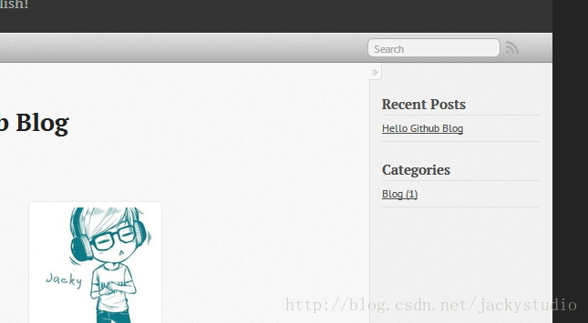
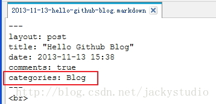
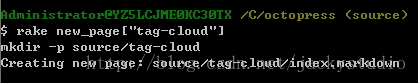
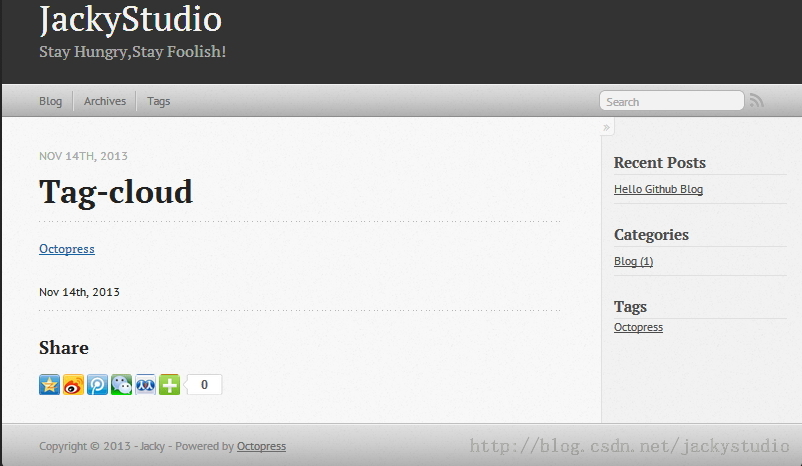

# 分类标签

给文章分类和添加标签是博客必不可少的功能，方便了信息的快速攫取。

## 添加分类

### 添加分类插件

进入 Octopress\plugins 目录，新建 category_list_tag.rb 文件，添加如下代码

```
module Jekyll  
  class CategoryListTag < Liquid::Tag  
    def render(context)  
      html = ""  
      categories = context.registers[:site].categories.keys  
      categories.sort.each do |category|  
        posts_in_category = context.registers[:site].categories[category].size  
        category_dir = context.registers[:site].config['category_dir']  
        category_url = File.join(category_dir, category.gsub(/_|\P{Word}/, '-').gsub(/-{2,}/, '-').downcase)  
        html << "<li class='category'><a href='/#{category_url}/'>#{category} (#{posts_in_category})</a></li>\n"  
      end  
      html  
    end  
  end  
end  
  
Liquid::Template.register_tag('category_list', Jekyll::CategoryListTag)  
```

### 添加边栏文件

进入 Octopress\source\_includes\custom\asides 目录，新建 category_list.html，添加如下代码

```
<section>  
  <h1>Categories</h1>  
  <ul id="categories">  
      
  </ul>  
</section>  
```

### 添加分类到主页面

打开 Octopress/_config.yml，在 default_asides 一栏中添加

```
default_asides: [..., custom/asides/category_list.html]  
```

### 生成页面，推送

```
rake generate  
rake preview  
rake deploy  
```

打开页面 http://geekjacky.github.io/，如下



### 推送 source 分支

```
git add .  
git commit -m "增加分类边栏"  
git push origin source  
```

### 给文章增加分类

还记得博文的开头有个 categories 么？填在这里就行了。



## 添加标签

标签可以加在边栏，也可以加在顶部导航，这里两种方法都介绍一下，我自己是加到导航栏，因为标签太多了，放在边栏不好看。

### 获取插件

先克隆这两个项目到本地，这里会使用到项目中相关的插件。

```
git clone https://github.com/robbyedwards/octopress-tag-pages.git  
git clone https://github.com/robbyedwards/octopress-tag-cloud.git  
```

（1）在 Octopress-tag-pages 中，复制 plugins/tag_generator.rb 到 Octopress/plugins 目录，复制 /source/_layouts/tag_index.html 到 /source/_layouts 目录，复制 source/_includes/custom/tag_feed.xml 到 /source/_includes/custom/ 目录。
（2）在 Octopress-tag-cloud中,复制 tag_cloud.rb 到 /plugins 目录。

### 增加标签

#### 增加到边栏

***增加边栏文件***

进入 Octopress\source\_includes\custom\asides 目录，创建 tags.html，添加如下代码

```
<section>  
  <h1>Tags</h1>  
  <ul class="tag-cloud">  
    {% tag_cloud font-size: 90-210%, limit: 10, style: para %}  
  </ul>  
</section>  
```

***添加标签到主页面边栏***

打开 Octopress/_config.yml，在 default_asides 一栏中添加

```
default_asides: [..., custom/asides/tags.html]  
```

#### 增加到导航栏

***增加新网页***

运行如下命令

```
rake new_page['tag_cloud']  
```



***在导航栏添加新页面***

进入 Octopress\source\_includes\custom，打开 navigation.html，添加一栏

```
<li><a href="/tag-cloud/">Tags</a></li>  
```

***修改标签内容***

进入 Octopress\source\tag-cloud 目录，修改 index.markdown，添加如下内容

```
<ul class="tag-cloud">{% tag_cloud font-size: 90-210%, limit: 1000, style: para %}</ul>  
```

### 给文章增加标签

用 markdownpad 打开博文，在 categories 下增加一行

```
tags: [Octopress]  
```

### 生成页面，推送

```
rake generate  
rake preview  
rake deploy 
```

打开 Tags 页面 http://geekjacky.github.io/tag-cloud/，如下



### 推送 source 分支

```
git add .  
git commit -m "添加标签"  
git push origin source  
```

### 生成博文时自动追加 tags

不想每次都手动添加 tag 这一行，没问题。打开 Octopress 目录下的 Rakefile，加入下面这一行，加在哪？你找得到的。

```
post.puts "tags: "  
```

### Bug

如果在使用标签生成静态页面的时候，出现如下错误。

```
Liquid Exception: comparison of Array with Array failed in page  
```


