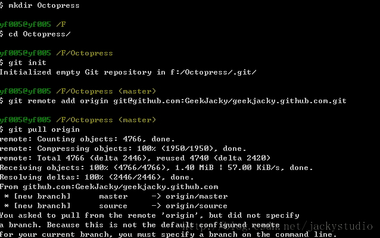
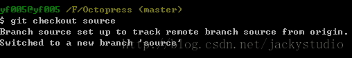
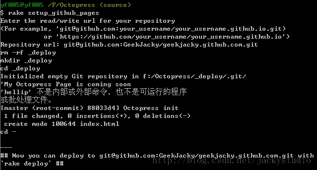
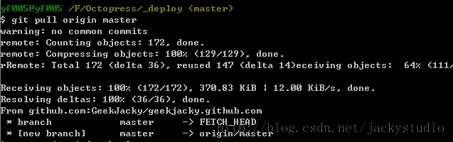
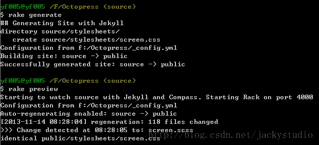

# 博客克隆

很多情况下我们需要在不同电脑之间维护同一个 Octopress 博客，那应该怎么在一台新的电脑上获取你的 Octopress 克隆呢？

## 环境配置

安装 msysgit，Ruby，DevKit，这里就不再重复了，请参考第一篇：[环境搭建](environment.md)。
除安装 octopress 依赖项外。octopress 依赖项在拉取仓库后再进行安装，也就是在本文是建立 github pages之前。

## 克隆你的 Octopress

### 拉取 Octopress 仓库内容

这里得主要要克隆自己的 Octopress 仓库，而不要去克隆 imathis 大神的仓库了。进入要放置 Octopress 的目录，这里我选择 F 盘根（换电脑记得 SSH 密钥要重新创建添加）。打开 git bash，执行如下命令。

```
mkdir Octopress  
cd Octopress/  
git init  
git remote add origin git@github.com:GeekJacky/geekjacky.github.com.git  
git pull origin  
```

初始化 git 仓库，添加远程仓库，也就是你自己的 Octopress 地址，pull 远程仓库。



### 切换到 source 分支

这时候进入 Octopress 目录，发现除了初始化生成的`.git`目录，什么都没有。没事，执行如下命令。

```
git checkout source  
```

是不是 source 分支的东西都出来了。还没完。因为`_deploy`目录还没有呢。



### 建立github pages

运行如下命令

```
rake setup_github_pages 
```

查看 Octopress 目录，发现`_deploy`目录出来了。但是里面还是只有`.git`和`index.html`文件。

 

### 拉取 master 分支

进入`_deploy`目录，运行如下命令

```
git pull origin master  
```

这时候再进`_deploy`目录，发现东西都回来了。



### 切换回 source 分支

运行如下命令，切换至 source 分支

```
git checkout source  
```

至此，Octopress 就在另一台电脑上克隆好了，你可以在不同的电脑上维护同一个博客。运行一下如下命令，确认没有问题。

```
rake generate  
rake preview  
rake deploy  
```



## 注意

### 记得 push

不过需要注意的是在不同的电脑上维护同一个博客，需要处理好同步的问题。每台电脑在处理完博客事务后记得要要运行。

```
rake deploy   
```

```
git add .  
git commit -m "commit message"  
git push origin source  
```

### 记得 pull

在开始处理博客事务之前，需要同步 Github 仓库的数据。

```
cd Octopress/  
git pull origin source  
```

```
cd _deploy  
git pull origin master  
```
