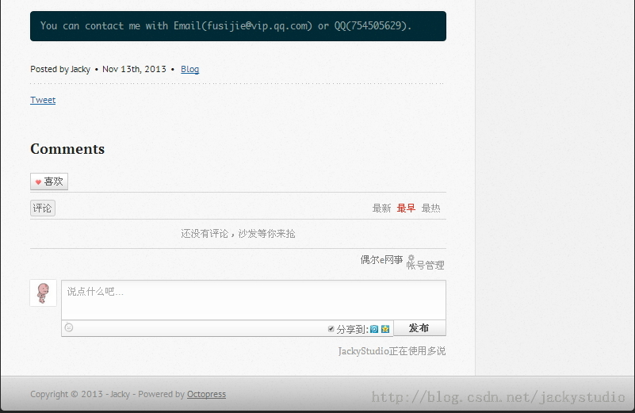

# 评论功能

博客怎么能少了评论呢？虽然 Octopress 自带了 disqus 评论系统，但是登录需要使用推特，脸书，Google+等帐号登录，因大多人都没有这些账户，所以使用国内的多说评论系统，非软文，可以用国内大部分主流帐号登录评论即可。

## 获取评论代码

进入[http://duoshuo.com/create-site](http://duoshuo.com/create-site)，登录帐号，填写相关信息，点击创建。这里的多说域名就是你的多说后台，可以在这里管理你的评论。
这里我获取的代码是，自行修改 short_name。

```
<!-- Duoshuo Comment BEGIN -->  
    <div class="ds-thread"></div>  
<script type="text/javascript">  
var duoshuoQuery = {short_name:"jackystuio"};  
    (function() {  
        var ds = document.createElement('script');  
        ds.type = 'text/javascript';ds.async = true;  
        ds.src = 'http://static.duoshuo.com/embed.js';  
        ds.charset = 'UTF-8';  
        (document.getElementsByTagName('head')[0]   
        || document.getElementsByTagName('body')[0]).appendChild(ds);  
    })();  
    </script>  
<!-- Duoshuo Comment END -->  
```

## 添加评论

进入 Octopress\source\_includes\post，创建名为 duoshuo.html 的文件，把上面的代码拷入。

进入 Octopress\source\_layouts，打开 post.html，在 disqus 布局后面加入多说的布局。

```
  
  <section>  
    <h1>Comments</h1>  
    <div id="comments" aria-live="polite"></div>  
  </section>  
  
```

进入 Octopress 目录，打开`_config.yml`，在末尾添加如下代码，如果想关闭多说评论，把 true 改为 false 即可。

```
# duoshuo comments  
duoshuo: true  
```

## 生成页面，推送

完成以上步骤后，执行

```
rake generate  
rake preview  
rake deploy  
```

查看文章页面`http://geekjacky.github.io/blog/2013/11/13/hello-github-blog/`



## 推送 source 分支

```
git add .  
git commit -m "添加多说评论"  
git push origin source  
```

