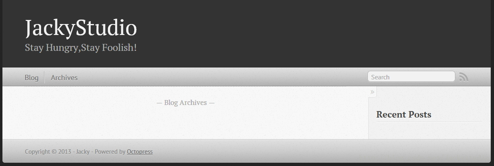
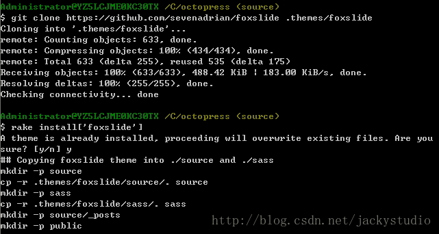

# 配置博客

Octopress Push 到 Github 之后，就可以对博客进行一些个性化配置了，这里先介绍一些基本配置。

## 基本配置

博客的基本配置文件在 Octopress 目录下的`_config.yml`。可以对需要修改的进行修改。

```
# ----------------------- #  
#      Main Configs       #主要参数  
# ----------------------- #  
  
url: http://GeekJacky.github.io   #网址  
title: JackyStudio          #博客标题  
subtitle: Stay Hungry,Stay Foolish!   #副标题  
author: Jacky  #作者  
simple_search: http://google.com/search  #搜索引擎  
description:   #描述  
  
subscribe_rss: /atom.xml  #rss地址  
subscribe_email:     #提供Email订阅的地址  
email:  #Rss订阅的Email地址  
  
# ----------------------- #  
#    Jekyll & Plugins     #Jekyll & 插件  
# ----------------------- #  
  
# 路径设置  
root: / #博客路径  
permalink: /blog/:year/:month/:day/:title/ #文章的固定链接形式  
...  
  
paginate: 10          # 每页文章数  
pagination_dir: blog  # 存放地址  
recent_posts: 5       # 显示最近文章篇数  
excerpt_link: "Read on →"  #继续阅读链接文字  
  
# 边栏  
default_asides: [asides/recent_posts.html, asides/github.html, asides/delicious.html, asides/pinboard.html, asides/googleplus.html]  
  
# ----------------------- #  
#   3rd Party Settings    #第三方设置  
# ----------------------- #  
```

修改后打开 cmd，运行如下命令（可以不预览，直接推送）

```
rake generate  
rake preview  
rake deploy 
```

 

## 更换主题

Octopress 安装主题也是很简单。

### 下载主题

Octopress 的 github wiki 提供给我们一大堆主题，还提供了预览。当然都是有爱的网友开源的，来这里挑吧：[https://github.com/imathis/octopress/wiki/3rd-Party-Octopress-Themes](https://github.com/imathis/octopress/wiki/3rd-Party-Octopress-Themes)
主题的安装很简单：先把主题克隆到本地 Octopress 目录下的`.themes`目录，运行 rake install 命令，推送即可。Octopress 默认主题是 classic。当然如果你愿意，你也可以 DIY 一个主题，不过记得分享出来。

```
$ cd octopress  
$ git clone GIT_URL .themes/THEME_NAME  
$ rake install['THEME_NAME']  
$ rake generate  
```

### 示例

我看上了 FoxSlide 这款主题，高端大气上档次，demo 地址是[http://www.adrianartiles.com/](http://www.adrianartiles.com/)，Github 地址是 [https://github.com/sevenadrian/foxslide](https://github.com/sevenadrian/foxslide)。

打开 git bash 运行如下命令：

```
$ cd Octopress  
$ git clone https://github.com/sevenadrian/foxslide .themes/foxslide  
$ rake install['foxslide']  
$ rake generate  
$ rake deploy  
```



到 github.io 看一下，是不是瞬间也洋气了很多。记得把 source 分支也 push 上去。


