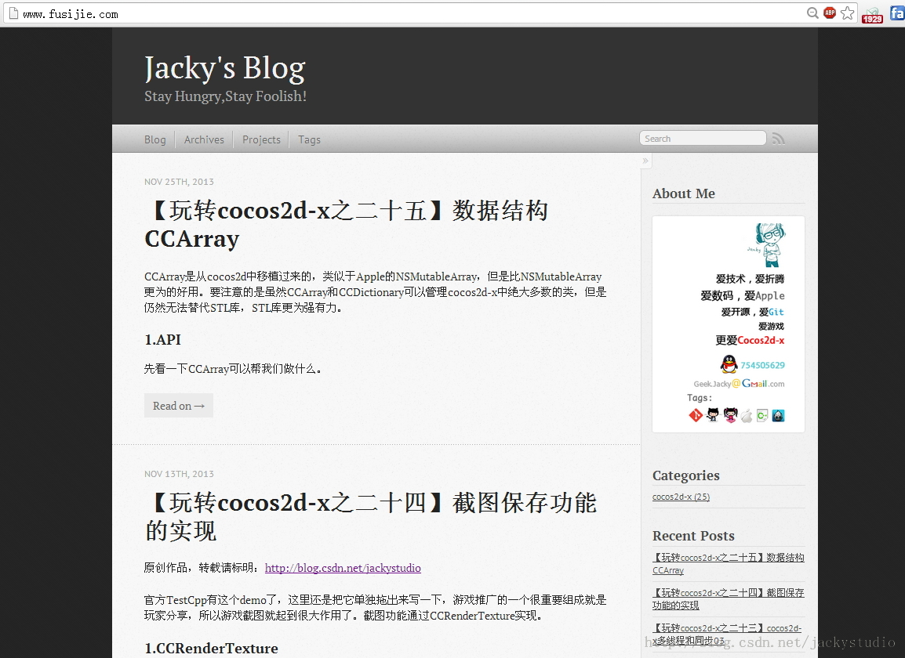

# 域名绑定

相信很多人都有自己的域名，而 github 帮你提供了免费的空间。让你的域名直接转到 github.io 是个不错的注意。假设通过之前 9 篇文章，你已经初步建立起一个 github.io 的博客了。

## CNAME

### 增加 CNAME 文件

我已经有了一个域名[www.fusijie.com](www.fusijie.com)。如果没有请先看第 2 步。
进入 Octopress\source，运行如下命令

```
touch CNAME  
vim CNAME  
```

在 VIM 中输入[www.fusijie.com](www.fusijie.com)。保存退出。

### 修改 url

修改 _config.yml，修改 url 为 [www.fusijie.com](www.fusijie.com)

### 生成静态页面，并推送

```
rake generate  
rake deploy  
```

### 推送 source 分支

```
git add .  
git commit -m "添加域名绑定"  
git push origin source  
```

## 注册域名

有域名的话 pass。

### 注册帐号&购买域名

可以在 Godaddy 买的。这里就以 [Godaddy](https://www.godaddy.com/) 为例。

### 修改域名指向

- 登录帐号，进入 visit my account。
- 选择 Domain→你的域名→Launch，进入后台控制面板。
- 点击 DNS→DNS Manager。


- 点击域名下的 Edit Zone，可以看到 Host 和 Points to，如果希望在顶级域名指向 Github 博客，那么在 @一栏的指向填入 207.97.227.245。那么顶级域名就可以直接指向 Github 博客了。


如果希望 www 的二级域名也可以指向这个博客地址，保证 www 指向 @ 即可，如果想要在二级域名下指向博客的话，那就在该二级域名的 Points to 填入上面 ip 即可。


## 泡壶茶

不要急着打开你的网站，这个时候可能是 404，泡壶茶回来就好了，围观吧。

**欢迎光临我的个人网站http://www.fusijie.com！**




