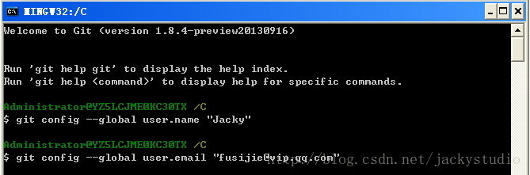
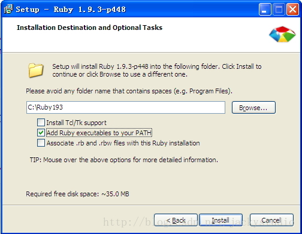
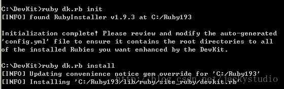
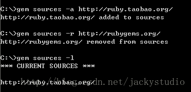
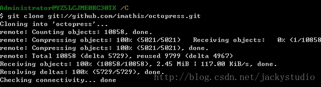
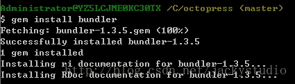
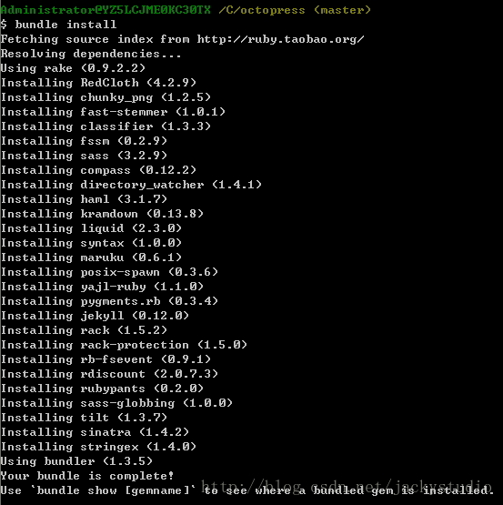

# 环境搭建

在 Github 上利用 Octopress 框架搭建了一个博客，所有的东西都可以 DIY，感觉还是蛮酷的。这里把整个搭建过程分享一下。当然第一步还是环境的搭建。

## 博客演示

演示地址：[http://fusijie.github.io](http://fusijie.github.io)，因为绑定了域名，所以会跳转到[http://www.fusijie.com](http://www.fusijie.com)。因为本人对网页编写一窍不通，多年来水平一直停留在看懂几个标签上，所以如果有理解错或者写错，敬请指出，虚心受教。

## 搭建本地环境

### 安装 msysgit

下载地址：[http://msysgit.github.io/](http://msysgit.github.io/)。安装方式和配置请移步：[http://blog.csdn.net/jackystudio/article/details/12249303](http://blog.csdn.net/jackystudio/article/details/12249303)



### 安装 Ruby

下载地址：[http://pan.baidu.com/share/link?shareid=3885776025&uk=637953331](http://pan.baidu.com/share/link?shareid=3885776025&uk=637953331)。这里使用 ruby 1.9.3p448 版本，安装时勾选 Add Ruby executables to your PATH。



将 ruby 加入系统环境路径，安装完成后 cmd 执行：

```
ruby -v  
```

确认是否添加成功。如果忘记勾选了，手动加入即可。

```
rubycmd.jpg
```

### 安装 DevKit

下载地址：[http://pan.baidu.com/share/link?shareid=3891765640&uk=637953331](http://pan.baidu.com/share/link?shareid=3891765640&uk=637953331)。这里使用 4.5.2 版。解压到`D:\DevKit`，打开 cmd，执行如下命令：

```
D:  
cd D:DevKit  
ruby dk.rb init  
ruby dk.rb install  
```




## 配置环境

### 支持 UTF-8 编码

配置 Windows 环境变量如下：

```
LANG=zh_CN.UTF-8  
LC_ALL=zh_CN.UTF-8  
```

### 替换更新源

```
gem sources -a http://ruby.taobao.org/  
gem sources -r http://rubygems.org/  
gem sources -l  
```

因为不翻墙 ruby 网站上不去,所以需要更换 ruby 的更新源，第一个是添加，第二个是删除，第三个是显示，如果显示输出[http://ruby.taobao.org/](http://ruby.taobao.org/)，就对了。




### 克隆 Octopress 库

进入你要存放博客源码的目录，我这里是直接使用 C 盘盘根。执行命令:

```
cd c:  
git clone git://github.com/imathis/octopress.git  
```

然后你就会发现在 C 盘根目录下多了一个 Octopress 的文件夹。



进入 Octopress 文件夹，用 UE 或者 Sublime Text 打开 Gemfile 文件：
替换`source “http://rubygems.org/”`为`source “http://ruby.taobao.org/”`

### 安装 Octopress 依赖项

打开 cmd，运行如下命令：

```
C:  
cd octopress  
gem install bundler  
bundle install 
```







>如果出现错误，请尝试更换 ruby 版本。

