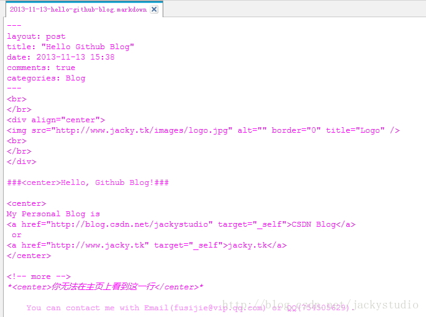

# 发表博文

Octopress 结合 Github 搭建博客是很酷，但是别忘了初衷是写博文，可不要本末倒置了。

## 发表博文

### 新建博文

使用如下命令新建博客文章

```
rake new_post['Hello Github Blog']  
```


### 编辑博文

可以在 Octopress/source/_posts 中看到`2013-11-13-hello-github-blog.markdown`，这就是博文了，这是用 markdown 语法写的，编辑完内容后保存。

### 预览博文

```
rake generate  
rake preview  
```


### 发布博文

```
rake deploy 
```


### 推送 source 分支

```
git add .  
git commit -m "First Blog"  
git push origin source  
```

## Markdown

### 概况

Octopress 写博客是用 markdown 写的，markdown 是一种轻量级的标记语言，相关介绍请参照维基百科[http://zh.wikipedia.org/wiki/Markdown](http://zh.wikipedia.org/wiki/Markdown)
Windows 下推荐使用 markdownpad2 编辑器，下载地址：[http://markdownpad.com/](http://markdownpad.com/)，它提供了实时预览的功能，当然收费版更强大，对于普通用户，免费版足够了。

### 语法

markdown 的语法可以参见：

- Wow！Ubuntu：[http://wowubuntu.com/markdown/](http://wowubuntu.com/markdown/)
- 简书：[http://jianshu.io/p/q81RER](http://jianshu.io/p/q81RER)
- cnodejs：[http://cnodejs.org/topic/50f6bc56df9e9fcc58745985](http://cnodejs.org/topic/50f6bc56df9e9fcc58745985)

### 示例

用 markdownpad2 打开刚刚创建的博文 2013-11-13-hello-github-blog.markdown，可以看到

```
---  
layout: post #布局  
title: "Hello Github Blog"  #标题  
date: 2013-11-13 15:38  #时间  
comments: true #评论  
categories: #分类  
---  
```

修改如下，因为 markdown 允许兼容 html，所以可以直接用 html 语法来写。




按照发表博客的步骤执行，打开 geekjacky.github.io 可以看到：


点击 Read on → 可以看到整篇文章：


## 解决中文问题

你可能在执行 rake generate 时出现这个错误。


这是因为博客有中文的关系，用文本工具打开`C:\Ruby193\lib\ruby\gems\1.9.1\gems\jekyll-0.12.0\lib\jekyll\convertible.rb`，修改第 28 行为。

```
self.content = File.read(File.join(base, name), :encoding => 'utf-8') 
```

如下图，重新运行 rake generate 即可。


