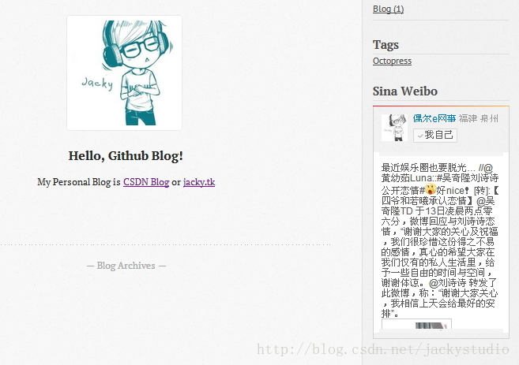

# 微博访客

这节介绍如何往边栏添加新浪微博和进行访客统计。

## 新浪微博

### 创建微博页面

进入 Octopress\source\_includes\custom\asides，创建 weibo.html，添加如下代码

```
  
<section>  
  <h1>Sina Weibo</h1>  
  <ul id="weibo">  
    <li>  
      <iframe   
        width="100%"   
        height="450"   
        class="share_self"   
        frameborder="0"   
        scrolling="no"   
        src="http://widget.weibo.com/weiboshow/index.php?width=0&height=450&fansRow={{site.weibo_fansline}}&ptype=10&speed=0&skin={{weibo_skin}}&isTitle=0&noborder=1&isWeibo=10&isFans=10&uid={{site.weibo_uid}}&verifier={{site.weibo_verifier}}">  
      </iframe>  
    </li>  
  </ul>  
</section>  
  
```

### 设置微博参数

进入 Octopress 目录，打开 _config.yml，添加如下代码

```
# Weibo  
# Please refer to http://weibo.com/tool/weiboshow to get your uid and verifier.   
weibo_uid: 1307211523          #WeiBo uid  
weibo_verifier: 3619ee9c        #WeiBo verifier  
weibo_showfans: false            #showfans  
weibo_fansline: 0                    #fansline  
weibo_show: true                    #show weibo  
weibo_pic: true                        #show pic  
weibo_skin: 10                        #skin  
```

这里的 uid 和 verifier是我自己的，替换成你的就行了，至于其他参数的含义，请参照[http://weibo.com/tool/weiboshow](http://weibo.com/tool/weiboshow)

### 添加到边栏

同样在 _config.yml，在 default_asides 一栏中添加

```
default_asides: [..., custom/asides/weibo.html]   
```

### 生成页面，推送

```
rake generate  
rake deploy  
```

这里没有预览是因为新浪微博秀在预览中看不到，只能 deploy 后看到，并且要第一次要刷新才看得到。

打开主页 http://geekjacky.github.io/，如下



### 推送 source 分支

```
git add .  
git commit -m "添加新浪微博"  
git push origin source 
```

## 访客统计

访客统计的代码有很多，Octopress 内置了 google 的统计，当然也可以选用百度等等，这里采用的是 Flag Counter 的代码，就是很熟悉的上面布满小国旗的那种。
官网在此[http://flagcounter.com/](http://flagcounter.com/) 

### 获取代码

进入官网，选取你要的款式，获取代码。

### 创建 flag_counter 页面

进入 Octopress\source\_includes\custom\asides，创建 flag_counter.html，添加如下代码，中间部分替换成你获取的代码。

```
  
<section>  
<h1>Visitor</h1>  
<div>  
    <p></p>  
    <center>  
    <a href="http://info.flagcounter.com/3pF8"></a>  
    </center>  
</div>  
</section>  
  
```

### 设置开关

进入 Octopress 目录，打开 _config.yml，添加如下代码

```
#flag_count  
flag_count: true  
```

### 添加到边栏

同样在 _config.yml，在 default_asides 一栏中添加

```
default_asides: [..., custom/asides/flag_counter.html]   
```

### 生成页面，推送

```
rake generate  
rake preview  
rake deploy  
```

打开页面 http://geekjacky.github.io/，如下


### 推送 source 分支

```
git add .  
git commit -m "添加flag_counter"  
git push origin source  
```

当然 Octopress 还有很多插件，使用原理也都差不多，可以参见 Octopress 的[github wiki：https://github.com/imathis/octopress/wiki/3rd-party-plugins](github wiki：https://github.com/imathis/octopress/wiki/3rd-party-plugins)


