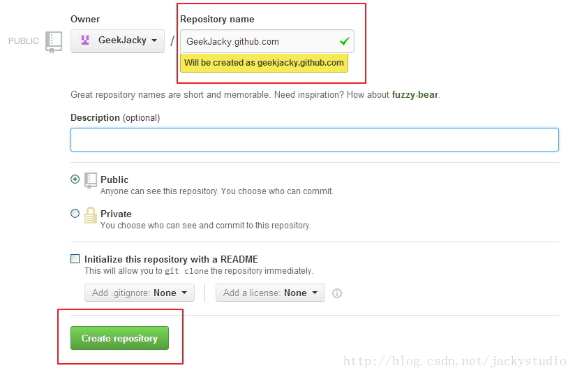
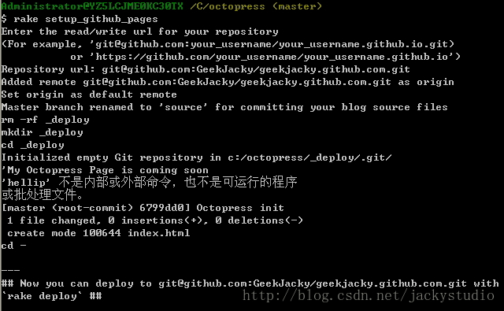
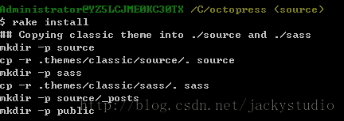
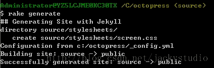
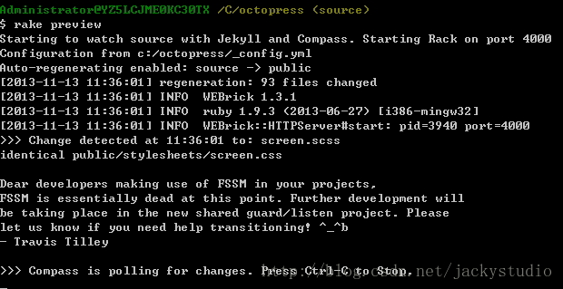
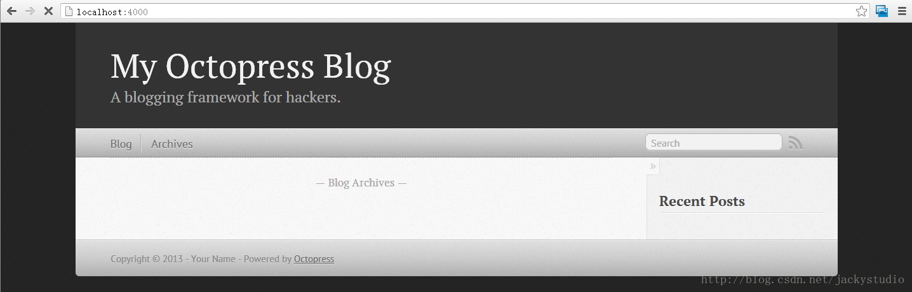
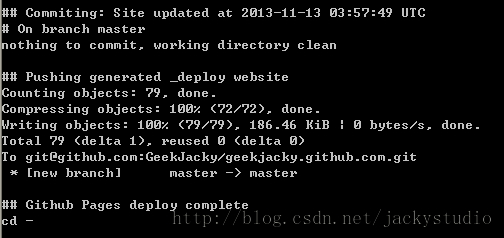
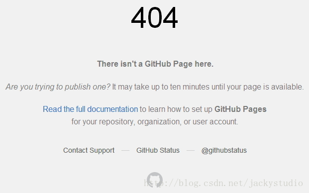
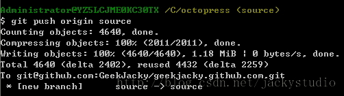

# 发布博客

本地环境配置完毕后就可以把 Octopress 推到 Github 上了。


## 新建 Github 仓库

仓库名字必须是 username.github.com，其中 username 是你的 github 用户名。描述和 Readme 可选，创建即可。



## 发布 Octopress 到 Github

### 建立 github page

打开 cmd，进入 Octopress 目录，执行如下命令：

```
rake setup_github_pages  
```

在 Repository url 中输入刚刚创建的仓库地址：git@github.com:GeekJacky/geekjacky.github.com.git，自行替换 username。



### 安装 Octopress 默认主题

```
rake install  
```



### 生成静态页面

```
rake generate  
```




### 本地预览

```
rake preview 
```



本地预览地址：[http://localhost:4000/](http://localhost:4000/)
这时候打开本地预览地址，可以看到如下页面，使用 Ctrl+C 停止预览。



### 发布博客到 Github

```
rake deploy  
```

这步会帮我们把 master 分支提交到 Github，但是平时我们编辑的则是 source 分支，source 分支则不会提交，需要我们手动提交。这里采用的是 SSH 方式推送的，如果出错，可能是没有创建 SSH 密钥，请按照此文设置[http://blog.csdn.net/jackystudio/article/details/12271877](http://blog.csdn.net/jackystudio/article/details/12271877)。



这时候打开[http://geekjacky.github.io](http://geekjacky.github.io)，可以看到如下页面（如果是 404 页面，那等一等，第一次 deploy 可能需要 10 分钟左右才能看到）：



正确显示效果


### 提交源文件，即 source 分支

```
git add .  
git commit -m “commit message”  
git push origin source  
```




