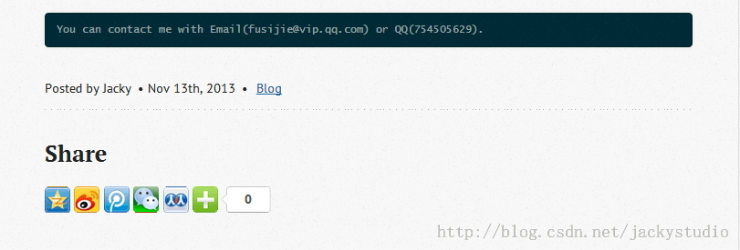

# 分享功能

Octopress 自带的分享代码是推特，脸书和 Google+，这里改用国内的加网分享，添加方式和评论相似。

## 获取分享代码

进入[http://www.jiathis.com](http://www.jiathis.com)，选择样式，点击获取代码。

比如我这里得到

```
<!-- JiaThis Button BEGIN -->  
<div class="jiathis_style_32x32">  
    <a class="jiathis_button_qzone"></a>  
    <a class="jiathis_button_tsina"></a>  
    <a class="jiathis_button_tqq"></a>  
    <a class="jiathis_button_weixin"></a>  
    <a class="jiathis_button_renren"></a>  
    <a href="http://www.jiathis.com/share" class="jiathis jiathis_txt jtico jtico_jiathis" target="_blank"></a>  
    <a class="jiathis_counter_style"></a>  
</div>  
<script type="text/javascript" src="http://v3.jiathis.com/code/jia.js?uid=1367457337064293" charset="utf-8"></script>  
<!-- JiaThis Button END -->  
```

## 添加分享

1. 进入`Octopress\source\_includes\post`，创建名为 jiathis.html的文件，把上述代码拷入即可。

2. 进入`Octopress\source\_includes\post`，打开 sharing.html，加入如下代码。

```
  
  <h2>Share</h2>  
        
    
```

3. 屏蔽掉推特分享链接

在第一行推特分享的判断语句上 and false。

```
  
```

4. 进入 Octopress 目录，打开`_config.yml`，加入

```
#share                                                                                      
share: true  
```

## 生成页面，推送

完成以上步骤后，执行

```
rake generate  
rake preview  
rake deploy  
```

查看文章页面 http://geekjacky.github.io/blog/2013/11/13/hello-github-blog/



## 推送 source 分支

```
git add .  
git commit -m "添加加网分享"  
git push origin source  
```


